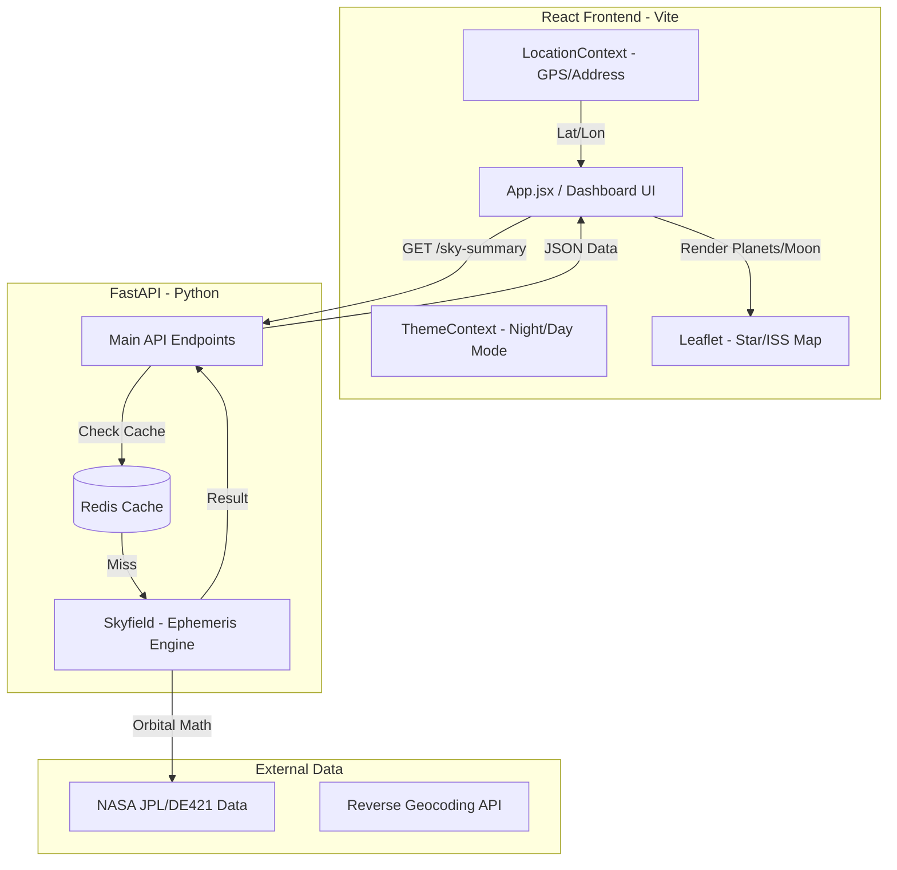
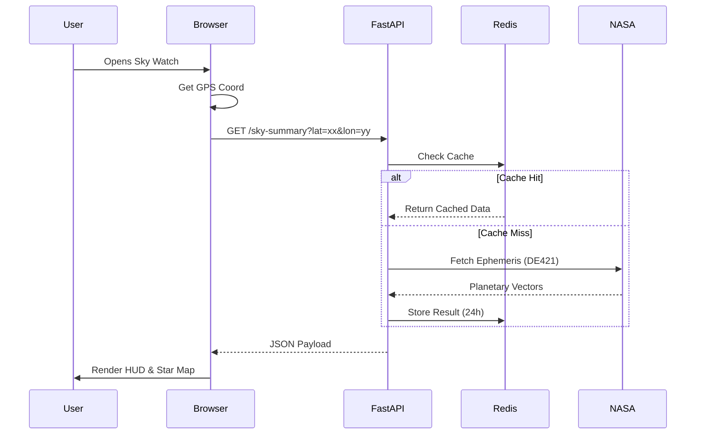

# 🌙 Sky Watch Telemetry Dashboard

A high-precision, observatory-style dashboard featuring real-time astronomical tracking and local weather synchronization.

## 🚀 Getting Started

Better yet, visit: [skywatchdash.com](https://www.skywatchdash.com)

To run this application locally, you will need **two terminal windows** open (Node.js and Python 3.8+ required).

### Frontend Setup (React + Vite)
```bash
cd skyapp-frontend
npm install
npm run dev

## BACKEND SETUP
## open your second terminal

cd backend
python -m venv venv


## activate virtual environment on Windows:

.\venv\Scripts\activate

## On Mac/Linux:
source venv/bin/activate

## Install libraries and dependencies

pip install -r requirements.txt

## Launch Uvicorn ASGI server

uvicorn main:app --reload
```
## 🛰️ System Architecture



## ⏱️ Timing Diagram


